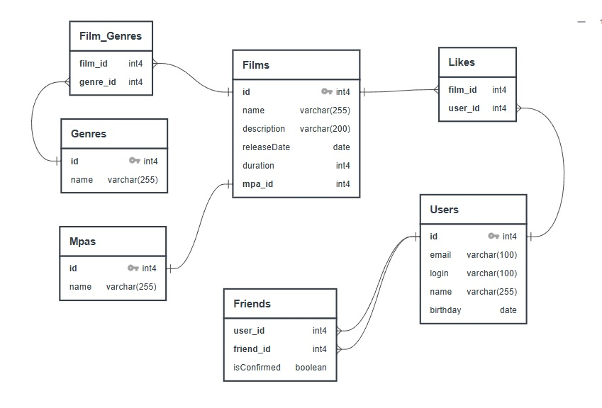

# java-filmorate
Данный проект - это сервис для кинотеки. На сервисе можно добавлять друзей и получать рекомендации на основе их лайков.

### Схема БД


### Примеры запросов

<details>
    <summary><h3>Для фильмов:</h3></summary>

* `Создание` фильма:

```SQL
INSERT INTO films (name,
                   description,
                   releaseDate,
                   duration,
                   mpa_id)
VALUES (?, ?, ?, ?, ?);
```

* `Обновление` фильма:

```SQL
UPDATE
    films
SET name                = ?,
    description         = ?,
    releaseDate        = ?,
    duration           = ?,
    mpa_id             = ?
WHERE id = ?;
```

* `Получение` фильма `по идентификатору`:

```SQL
SELECT f.id,
       f.name,
       f.description,
       f.releaseDate,
       f.duration,
       mp.name AS mpa_rating,
       g.name  AS genre
FROM films f
         JOIN mpas mp ON f.mpa_id = mp.id
         JOIN film_genres fg ON f.id = fg.film_id
         JOIN genres g ON fg.genre_id = g.id
WHERE f.id = ?;
```   

* `Получение всех` фильмов:

```SQL
SELECT f.id,
       f.name,
       f.description,
       f.releaseDate,
       f.duration,
       mp.name AS mpa_rating,
       STRING_AGG(g.name, ', ' ORDER BY g.name) AS genres
FROM films f
         JOIN mpas mp ON f.mpa_id = mp.id
         JOIN film_genres fg ON f.id = fg.film_id
         JOIN genres g ON fg.genre_id = g.id
GROUP BY f.id;
```

* `Добавить лайк` к фильму:

```SQL
INSERT INTO likes (film_id,                   
                   user_id)
VALUES (?, ?);
```

* `Удалить лайк` к фильму:

```SQL
DELETE FROM likes WHERE film_id = ? AND user_id = ?;
```

* `Получение топ-N (по количеству лайков)` фильмов:
```SQL
SELECT f.id,
       f.name,
       f.description,
       f.releaseDate,
       f.duration,
       mp.name AS mpa_rating,
       g.name AS genre,
       COUNT(fl.user_id) AS like_count
FROM films f
         JOIN mpas mp ON f.mpa_id = mp.id
         JOIN film_genres fg ON f.id = fg.film_id
         JOIN genres g ON fg.genre_id = g.id
         LEFT JOIN likes fl ON f.id = fl.film_id
GROUP BY f.film_id,
         mp.name,
         g.name
ORDER BY like_count DESC LIMIT ?;
```
</details>

<details>
    <summary><h3>Для пользователей:</h3></summary>

* `Создание` пользователя:

```SQL
INSERT INTO users (email,
                   login,
                   name,
                   birthday)
VALUES (?, ?, ?, ?)
```

* `Обновление` пользователя:

```SQL
UPDATE
    users
SET email    = ?,
    login    = ?,
    name     = ?,
    birthday = ?
WHERE id = ?
```

* `Получение` пользователя `по идентификатору`:

```SQL
SELECT *
FROM users
WHERE id = ?
```   

* `Получение всех` пользователей:

```SQL
SELECT *
FROM users
``` 

* `Получение списка друзей` пользователя:

```SQL
SELECT *
FROM users u
WHERE u.id in (SELECT f.friend_id FROM friends as f WHERE f.user_id =2)
```

* `Добавить друга` у пользователя:

```SQL
INSERT INTO friends (user_id,friend_id)
VALUES (?, ?)
```

* `Удалить друга` у пользователя:

```SQL
DELETE FROM friends WHERE user_id = ? AND friend_id = ?
```

* `Получение общего списка друзей` между пользователем (id) и его другом(friend_id):

```SQL
SELECT *
FROM users
WHERE id IN (SELECT str1.friends_id
			FROM (select f.friend_id FROM friends as f WHERE f.user_id =2) str1
			JOIN (select f.friend_id FROM friends as f WHERE f.user_id =1) str2 on str1.friend_id = str2.friend_id)
``` 


</details>

<details>
    <summary><h3>Для жанров:</h3></summary>

* `Получение` жанра `по идентификатору`:

```SQL
SELECT *
FROM genres
WHERE genre_id = ?
``` 

* `Получение всех` жанров:

```SQL
SELECT *
FROM genres
```   
</details>

<details>
    <summary><h3>Для рейтингов MPA:</h3></summary>

* `Получение` рейтинга MPA `по идентификатору`:

```SQL
SELECT *
FROM mpas
WHERE mpa_id = ?
``` 

* `Получение всех` рейтингов MPA:

```SQL
SELECT *
FROM mpas
```   
</details>

## Валидация

Входные данные, поступающие в запросе,
должны соответствовать определенным критериям:

<details>
    <summary><h3>Для фильмов:</h3></summary>

* Название фильма должно быть указано и не может быть пустым
* Максимальная длина описания фильма не должна превышать 200 символов
* Дата релиза фильма должна быть не раньше 28 декабря 1895 года[^1]
* Продолжительность фильма должна быть положительной
* Рейтинг фильма должен быть указан

</details>

<details>
    <summary><h3>Для пользователей:</h3></summary>

* Электронная почта пользователя должна быть указана и соответствовать формату email
* Логин пользователя должен быть указан и не содержать пробелов
* Дата рождения пользователя должна быть указана и не может быть в будущем

</details>

<details>
    <summary><h3>Над проектом работали:</h3></summary>

* 1) Функциональность «Фильмы по режиссёрам». 4 SP (ветка add-director). Выполнил: Поприйчук Евгений
* 2) Функциональность «Рекомендации». 3 SP (ветка add-recommendations). Выполнила: Мысина Екатерина
* 3) Функциональность «Удаление фильмов и пользователей». 2 SP (ветка add-remove-endpoint). Выполнил: Копылов Игорь
* 4) Функциональность «Поиск». 3 SP (ветка add-search). Выполнил: Копылов Игорь
* 5) Функциональность «Отзывы». 4 SP (ветка add-reviews). Выполнил: Поприйчук Евгений
* 6) Функциональность «Лента событий». 3 SP (ветка add-feed). Выполнил: Демиденко Владислав
* 7) Функциональность «Популярные фильмы». 2 SP (ветка add-most-populars). Выполнила: Мысина Екатерина
* 8) Функциональность «Общие фильмы». 1 SP (ветка add-common-films). Выполнил: Демиденко Владислав

</details>
